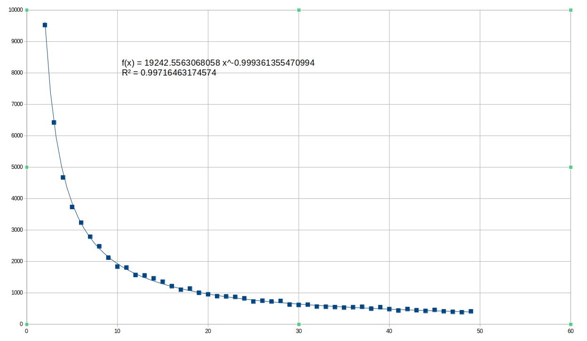

# k-Means
### Mick Bos en Youri de Vor

## Uitleg Code
### Call Tree
- genDataSet
- genLabels
- findminmax
- scale
- kMeans
    - findNearestCentroids
    - calculateNewCentroids

### Totaal-Uitleg
Door middel van de functies <b>genDataSet en genLabels</b>  wordt de dataseten de bijbehorende labellijst aangemaakt. Vervolgens worden de metingen in de lijst genormaliseerd door middel van <b>findminmax en scale</b> 

Het <b>kMeans</b> algoritme werkt door middel van het maken van de clusters. Dit doet <b>findNearestCentroids</b> door voor ieder meetpunt de dichtsbijzijnde centroid te zoeken en aan het bijbehorende cluster toe te voegen. Daarna is het de taak van <b>calculateNewCentroids</b> om het gemiddelde van alle datapunten in het cluster te pakken en dit te gebruiken als nieuwe centroid.

In de main code wordt voor iedere K-waarde het algoritme 10 maal gedraaid en de laagste AICD* waarde gekozen om outliers zoveel mogelijk te voorkomen binnen acceptabele runtime. 

## Resultaten
### Tabel
|K	|AICD*	|Δ(AICD*)|Δ(Δ(AICD*))|
|---|---|---|---|
2|	9523.75485585923|	x	|x
3|	6422.11370023002|	-3101.64115562921|	x
4|	4672.68894843331|	-1749.42475179671|	1352.2164038325
5|	3733.076444249|	-939.612504184306	|809.812247612403
6|	3234.77954167139|	-498.29690257761|	441.315601606696
7|	2787.31493526697|	-447.464606404425|	50.8322961731847
8|	2481.23991947576|	-306.075015791204|	141.389590613222
9|	2120.37370849266|	-360.866210983102|	-54.7911951918982
10|	1835.41325952478|	-284.960448967887|	75.9057620152155
11|	1805.50496124369|	-29.9082982810885|	255.052150686798
12|	1568.46230117925|	-237.042660064437|	-207.134361783349
13|	1554.63548438087|	-13.8268167983813|	223.215843266056
14|	1462.00023042752|	-92.6352539533452|	-78.8084371549639
15|	1355.5824652721|	-106.417765155426|	-13.7825112020805
16|	1213.07090983894|	-142.511555433158|	-36.0937902777323
17|	1100.35883433671|	-112.71207550223|	29.7994799309279
18|	1136.68681979866|	36.3279854619502|	149.04006096418
19|	1002.44746404609|	-134.239355752569|	-170.567341214519
20|	953.390246895767|	-49.0572171503247|	85.1821386022441  

### Aggregate Intra-Cluster Distance geplot tegen K
     

In bovenstaand plot is een trendlijn gefit op de AICD per K. Door deze tweemaal af te leiden 

## Beste K
In de hierboven te vinden resultaten tabel is de AICD* tegen de K uitgezet, waarna de verandering en de "verandering van de verandering" ernaast uitgezet zijn. In de verandering van de verandering* is duidelijk te zien dat de deze hard afzakt na K = 6. Deze zakt bij K = 7 naar 50, waar deze bij de vorige stap nog ~10 keer zo groot was.
Op basis hiervan kiezen wij 6 als elleboog in het screeplot en is volgens de scree plot methode de ideale K dus 6.

<b> AICD </b> Aggregate Intra-Cluster Distance

<b> verandering van de verandering </b> voor onze doelen een acceptabele vervanger voor de tweede afgeleide van AICD* aangezien ΔK altijd 1 is in ΔAICD*/ΔK, omdat een ΔK van kleiner dan 1 geen toepassing heeft bij kMeans

