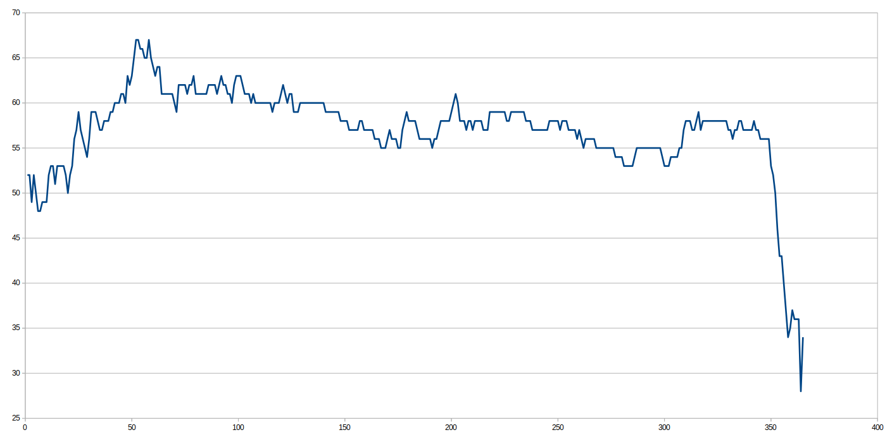

# k-Nearest Neighbours
### Mick Bos en Youri de Vor

## Uitleg Code
### Call Tree
main
-   genDataSet
-   findMinMax
-   scale
-   scale
    -   genDataSet
-   scale
    -   genDataSet
-   genLabels
-   genLabels
-   findK
    -  labelcounter
-   findLabel

### Totaal-Uitleg
Om te beginnen wordt de trainingsdataset aangemaakt met <b>genDataSet</b>. Hiervan wordt met <b>findMinMax</b> het minimum en maximum voor elk van de 7 parameters gevonden. Hiermee kunnen met <b>scale</b> deze dataset en de later aangemaakte validatie en testset ook worden geschaald.
<b>scale2</b> kan eventueel ook gebruikt worden wanneer er met gewichten gespeeld wil worden. In ons geval zijn er gewichten gebruikt die door bruteforce gevonden zijn met experiment.py.

Vervolgens wordt <b>genLabels</b> twee maal aangeroepen om een lijst met seizoensklassificaties aan te maken voor zowel de data set als de validatieset.

Hierna wordt <b>FindK</b> aangeroepen. <b>FindK</b> heeft als parameters de dataset, de validatieset en de bijbehorende klassificaties. Deze functie implementeert kNN om de beste K waarde te vinden voor het K-Nearest neighbours algoritme door de resultaten van alle K's te valideren met de validatieset. Binnen <b>findK</b> wordt de functie labelcounter aangeroepen om de meest voorkomende label terug te geven binnen het K aantal Nearest Neighbours voor het punt dat op dat moment geklassificeert wordt.

Wanneer de optimale K gevonden is kan met <b>findK</b> ongeklassificeerde dataset uit days.csv worden geklassificeerd en geprint. 

Eventueel kan er dus ook nog naar de experiment.py code worden gekeken. Hierin staat een stukje code om wegingen te bepalen waar hogere accuraatheid mee kan worden gehaald bij het valideren van K waarden. Deze code exploreert voor een bepaalde K voor elke parameter de gewichten 1, 2, 3 en 4. Hieruit volgde gewichten:  
[1, 1, 2, 4, 2, 1, 3]

## Resultaten
### Accuraatheid geplot tegen K

### Beste K
Er zijn 3 K's gevonden met dezelfde, hoogste accuraatheid. Hieronder de Top 5.
|Accuraatheid|K|
|:---:|:---:|
|67.0 |52
|67.0 |53
|67.0 |58
|66.0 |54
|66.0 |55

## Antwoord op de Vraag
['lente', 'winter', 'lente', 'zomer', 'lente', 'zomer', 'winter', 'winter', 'zomer']  
Used K:  52  

['lente', 'winter', 'lente', 'zomer', 'lente', 'zomer', 'winter', 'winter', 'zomer']  
Used K:  53  

['lente', 'lente', 'lente', 'zomer', 'lente', 'zomer', 'winter', 'winter', 'zomer']  
Used K:  58  

Zoals je hierboven kunt zien, hebben wij alle drie de K's met dezelfde hoogste accuraatheid getest op de opdracht dataset. Bij de tweede entry is de derde test het oneens met de andere twee. Wat ons betreft is het hier twee tegen een. Dus het uiteindelijke antwoord is:  
### lente, winter, lente, zomer, lente, zomer, winter, winter, zomer